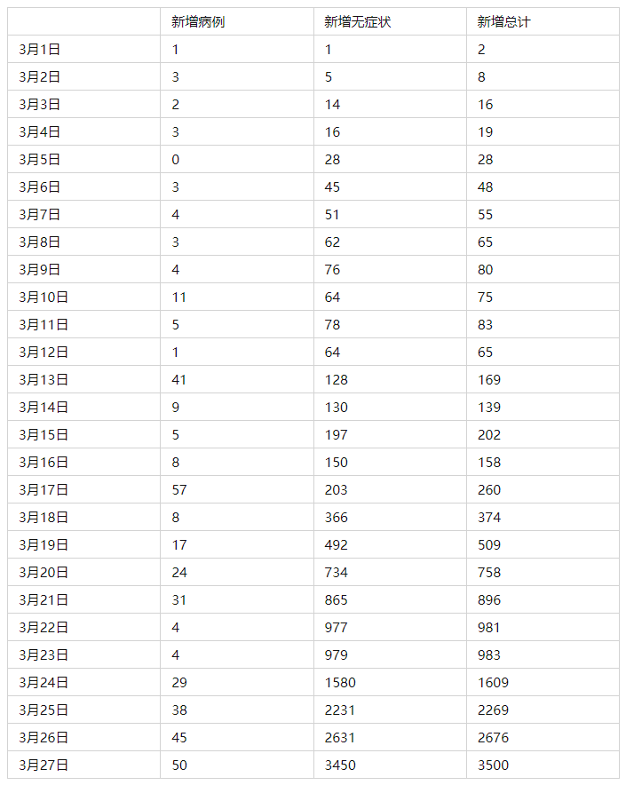
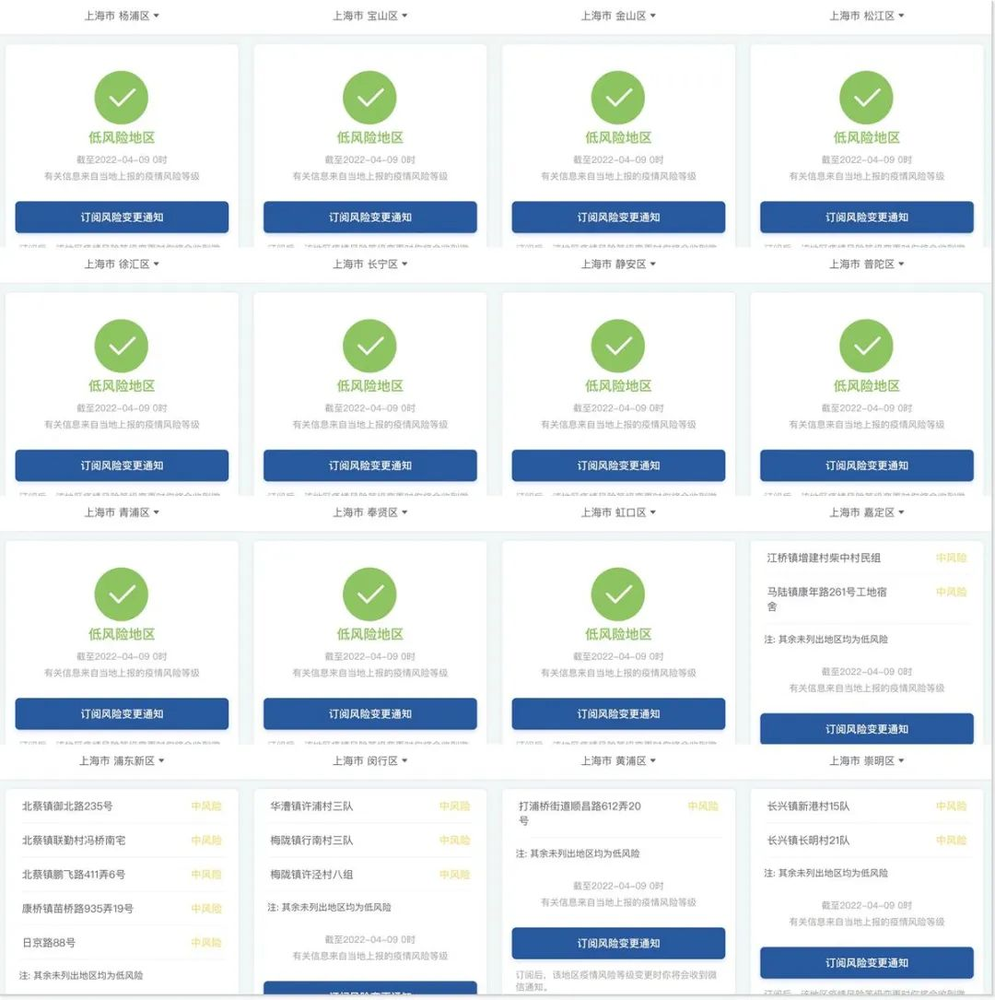
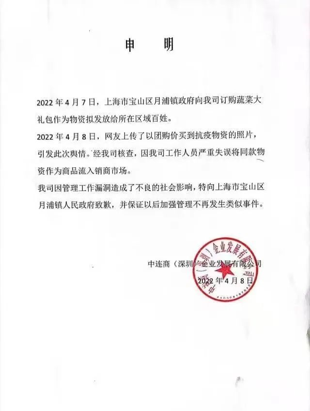
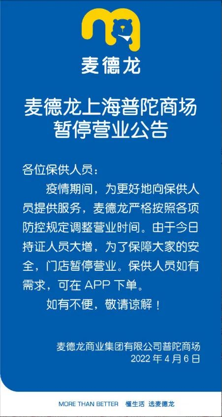
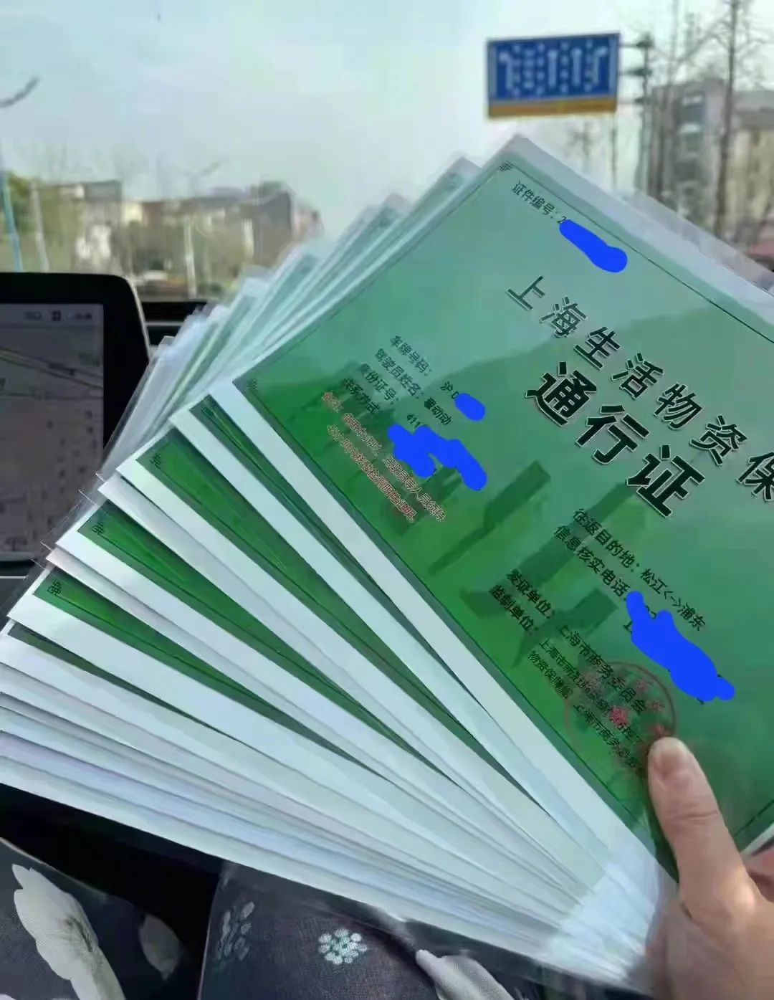
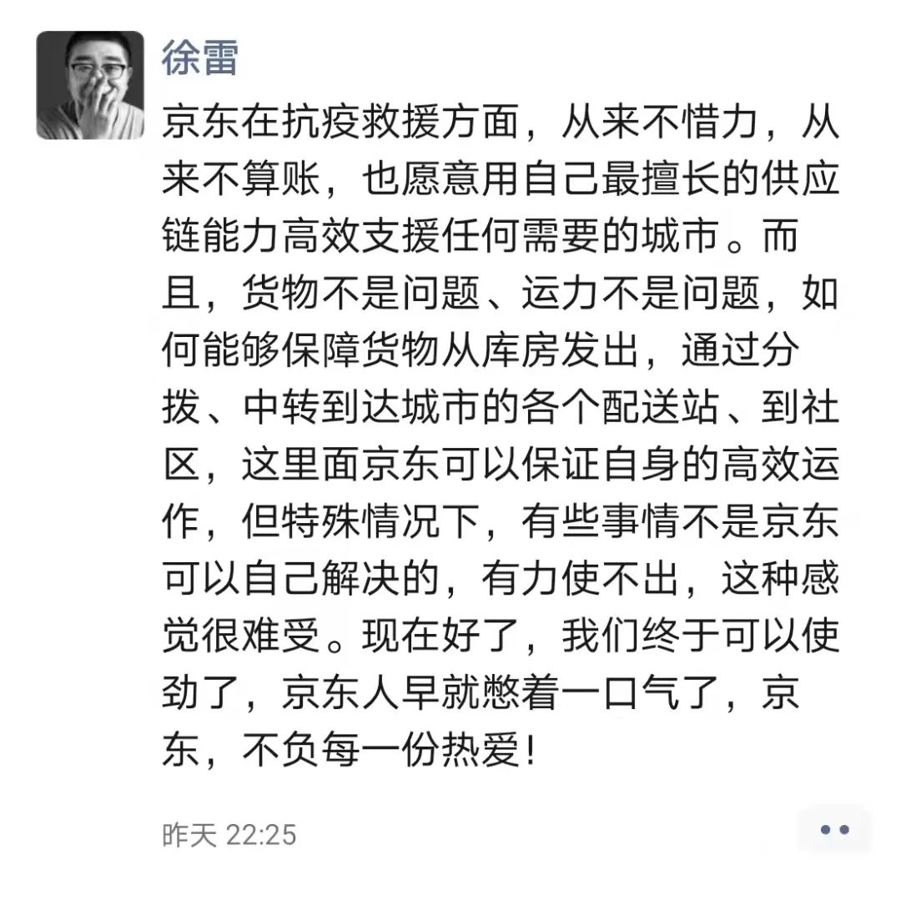
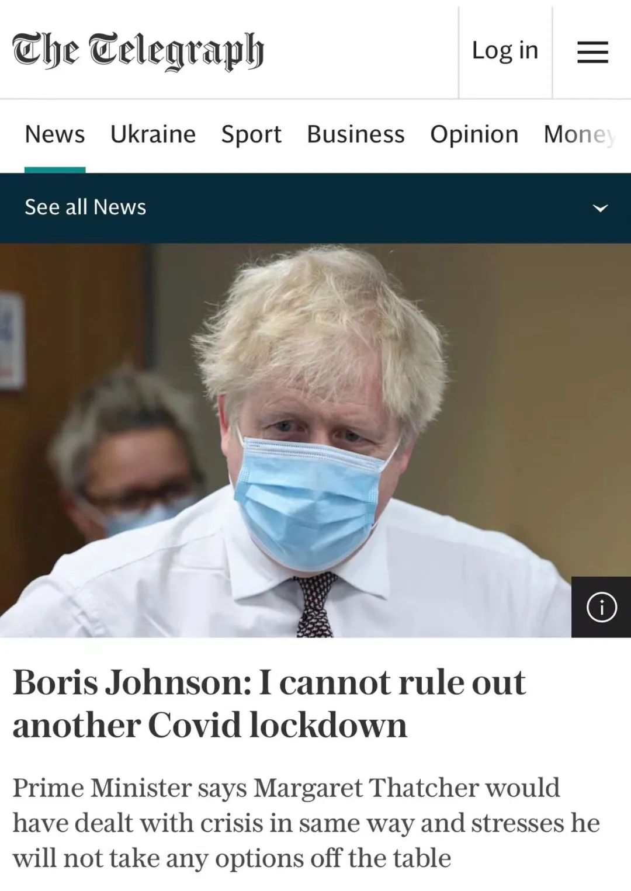
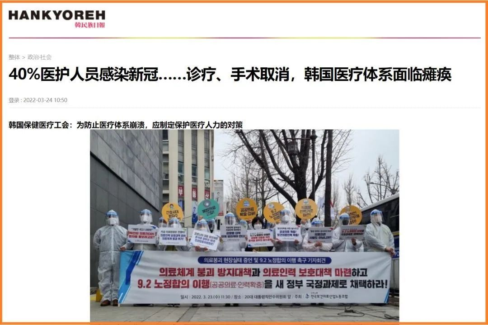
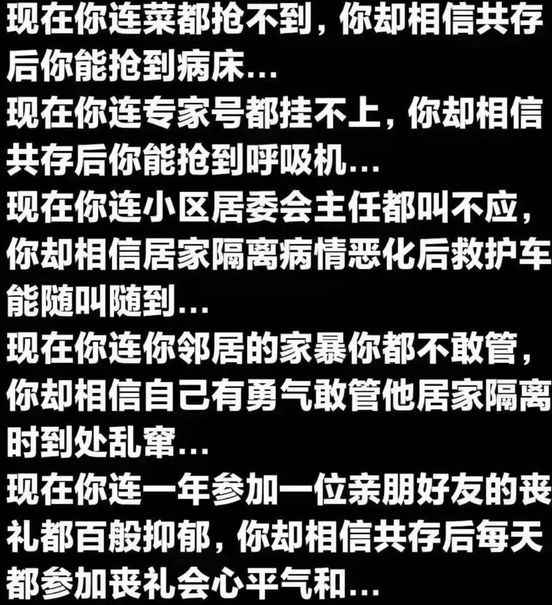
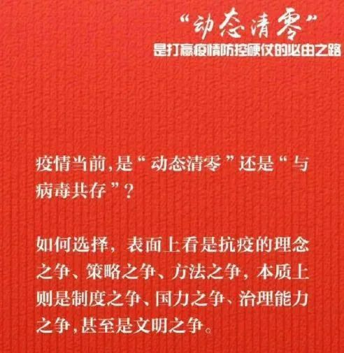

# 上海防疫，背后的国本之争

> 原标题：上海防疫，背后的国本之争
>
> 作者：智sir
>
> 公众号：智先生
>
> 发表时间： 2022-04-09 21:11

## 壹 华亭宾馆

上海疫情爆发的最初时间，是3月1日。

当天确诊了一位56岁的女患者，住在普陀区甘泉街道，她的主要活动范围是石泉社区文化活动中心，舞蹈队的七人相继确诊。

3月2日，松江区九里亭街道的永辉超市发现5例确诊阳性患者，密接里面有一名闵行区男司机被确诊阳性，同时导致嘉定区也出现6例确诊，这6例确诊里又有3名司机，轨迹多次涉及上海大学。

3月6日，上海疫情多点散开，徐汇区、浦东新区、黄浦区、静安区、闵行区都有确诊，当天一共48例。

这就是奥密克戎的传播威力，比初期的新冠传播速度快4倍。

3月8日，上海确诊65例，其中有四例在徐汇区漕溪北路1200号发现。

漕溪北路1200号，也就是大名鼎鼎的华亭宾馆。

华亭宾馆始建于1983年，是上海第一批涉外的五星级宾馆，在当时看起来高端大气，如今内部已经非常老旧了，套房里还有充满历史的古董电视。

今年2月16日，华亭宾馆歇业，启动全面装修改造计划，改造工程预计2年。

但因为香港疫情爆发，导致入境旅客激增，在这种防疫压力下，华亭宾馆重新启用，被征用为隔离酒店。

国内绝大部分酒店，包括华亭宾馆的室内通风，都是依靠集中空调系统，如果没有经过有效的隔离技术处理，不适合作为临时隔离酒店，甚至会导致奥密克戎在酒店内传播，突破隔离闭环向外扩散。

3月11日，上海官方确认：**松江、嘉定、闵行、黄浦、徐汇、宝山、浦东新区等疫情感染来源聚焦于中风险地区漕溪北路1200号（华亭宾馆）**。

虽然查明了传染源是华亭宾馆，但在接下来半个月，上海疫情没有任何止住趋势，反而多点爆发，问题出在了哪里？

## 贰 上海模式

3月14日，国家卫健委办公厅发布《**新型冠状病毒肺炎诊疗方案（试行第九版）**》，给了明确诊疗要求：

只要测核酸时发现阳性，就要立即隔离，进行临床诊断，结合流行病史、实验室检测和影像学检查，最后划分轻中重型。

全国大部分城市的标准做法是，测出来核酸阳性后，哪怕没有肺部阴影，哪怕只是发热干咳乏力等症状，都一律划分为确诊轻症患者。

所以在正常情况下，确诊患者和无症状患者的比例应该大致相当。

上海的无症状患者相当多，从比例来看达到匪夷所思的地步，比如4月8日的最新确诊：**新增1015例本土确诊，新增22609例无症状感染者**。

显然，上海有自己的判断理解，到底是什么样的统计方式，才能造成如此多的无症状感染数量？

目前网上的最主流观点是，可能由于医疗挤兑，导致许多阳性患者无法拍CT，难以获悉肺炎影像，哪怕有咳嗽发热等明显症状，也会被统一划归无症状感染者。

我不清楚这个划分标准究竟是什么，上海官方没有进一步说明。

如此庞大的无症状感染者，按照官媒的报道内容，有上海市某区疾控工作人员提出一个看法：「**无症状感染者涉及区域不划定中高风险。**」

也就是说，目前上海各区的中高风险划分标准，可能是按照「本土确诊病例」来划分，没有将「无症状感染者」算进去。

我很疑惑的是，无症状感染者就没有传播危险了吗？

直到4月9日，上海依然没有一处高风险地区：

是全国各地的高风险划分标准不一吗？确实如此。

> 北京：14天内新增2起及以上聚集性疫情、或新增超过5例本地确诊病例；
>
> 四川：14天内发生2起及以上聚集性疫情、或出现超过10例确诊病例；

绝大部分省市按照四川标准执行，也就是10例确诊病例=高风险区域。

可是，上海累计报告阳性感染者超过15万例，哪怕「无症状感染者」不计算在内，确诊人数仍然有5408例，如此庞大的数字出现在一座大城市里，竟没有一处高风险区域，无论如何都说不过去吧？

早在2月14日，上海就加强来沪人员的健康管理：

> 对所有来自或途经国内疫情高风险地区的来沪返沪人员，一律实施14天集中隔离健康观察，实行4次新冠病毒核酸检测（第1、4、7、14天）。

这条健康管理，说明上海清楚知道高风险地区的传播危险，而从3月13日开始，上海新增超过100例（确诊+无症状），到3月下旬，上海疫情已经悄无声息外溢各地。

有不少无症状感染者拿着国务院绿码在全国随便跑，而且健康云也显示阴性，可以坐动车，到落地测核酸时就变阳了。

这种情况会造成什么后果？

来自上海的绿码不可信，中低风险区域也不可信，东部一些城市只能采用无差别的管控方式，一视同仁所有上海市民。

注意，上海周边城市的层层加码，严防严控，直接导致了后续更为严重的物资配送紧缺问题。

3月27日，上海日新增3500例，正式进入「全域静态管理」。

## 叁 封城乱象

距离封城前的十多天，上海依然有充足时间来安排物资调配，毕竟本土一堆赫赫有名的企业，不管国企民企还是外企，都拥有相当强势的供应链，还有高效率的运输系统，在物资供应问题上完成不成问题。

事与愿违，从3月中旬，上海一些区域进入封控管理后，就已经出现物资调配困难、医疗资源紧张的问题了，各街道各自为政，绿色通道形成虚设，120热线严重挤兑，被隔离的居民只能通过团购和买菜软件抢购——明明这个阶段的隔离管控不应该出问题。

随着阳性小区越封越多，在3月28日宣布浦东进入「全域静态管理」后，仍然给足市民疯抢物资的时间，导致潜在病例加剧。

这里暴露了两个问题：

第一个是地方的物资保障方面没有做到位，让居民出门抢购自救，证明了哪怕有大半个月时间，上海防疫管理的问题仍然无法弥补解决，必须匆忙封城。

第二个是明知道会聚集感染，市民依旧选择抢购，说明已经不对当地抱有太高期望，得按最坏情况做准备，哪怕只是宣布封城4-5天。

事实上，那些真正相信只封控4-5天，而没有提前采购过冬的市民，现在都要去微博求助，并且后悔没有把货架上的老坛酸菜面一起带走。

至今，围绕上海的核心话题还是买菜难，App抢不到，天价团购，地区保供有限。骂居委会的人特别多，一问三不知，组织拉胯，防疫封禁形同虚设，配送物资缓慢，没有紧急预案，无力维护社区秩序，大规模聚集测核酸，各种惹民愤的矛盾事件集中爆发。

但越到后面，开始理解居委会的百姓逐渐变多，他们很快意识到真正的症状在哪里，各街道下发大量任务，层层加码全压在居委会身上，居委除了无法提供医疗服务外，几乎所有大小事情都要处理解决，上面却没有派下来多少人力援助，12345长期忙音，来自基层的一线声音完全无法反馈。

许多居委会依靠社工和志愿者勉强维持秩序，情绪濒临崩溃，却仍然要维持最基本的秩序，否则小区会更乱套。所以如今的局面是，居民买菜看病吃药困难，居委会和社区志愿中心疲于应对，反映无门，而这个过程中还有一些人在发国难财。

云南捐赠宝山区的蔬菜物资，被68元转卖，有恃无恐，连标签都不撕，然后企业匆忙站出来道歉：

你们应该对宝山区的市民致歉，而不是向上海市宝山区月浦镇人民政府致歉，主体都搞错了。

4月6日，麦德龙上海普陀商场暂停营业，因为当天持证人员大增：

为什么在如此短的时间内，会有这么多持通行证的人出行采购，这些证是发给谁的，又是从哪里发出去的？

这些通行证纯纸质，说明没有任何电子信息联网，上级部门盖章了事，按量分配给企业和社区，也就无法掌握各地的发放数量。

**围绕上海的最核心矛盾，是物资多 ，但没人送。**

各大电商平台和物流公司，明明有充足运力，可以从全国各地库房运送米面粮油给上海，却因为库房被封，通往上海的道路被封，无从施展。

京东集团CEO徐雷在微信群的聊天里谈到：

> 各地政府要求不一样，经常进去十个货车司机吃掉十个货车司机，没有车证进不去也出不来。
>
> 地方政府和部位可能对「供应链」的理解不到位，政府一定要知道什么是保民生，不是环卫、卫生、公安这些公共部门才是民生，不是只有国企才是保民生，不是品牌商愿意供货就是保民生，供应链条上的关键点，一旦断掉啥都没有，商品在库房、蔬菜在地里。

全国各地都在接力援助物资，包括收购来的农产品，它们统一运输到上海的各处蔬菜集散中心进行储存，随后根据各区域人口进行分拣，接着货车司机运到各街镇的配送站，再转运到各小区门口，最后让志愿者分到每个人家里。

如此多的层级中转，得依靠大量人力来维持良好运转，现在就是缺人，哪怕抽调再多志愿者都无法填补缺口，每个基层环节都在按规定谨慎行事，能不出错就不出错，宁愿封控，宁愿效率低下。

这种糟糕情况该怎么彻底解决？

让非涉疫原因、被封控在小区的快递小哥等保供人员，全部走出封控区，回到保供岗位；统筹各快递公司和电商平台，补足配送力量，完成「最后一公里」的配送任务，各环节杜绝任何卡点。

上海封控了如此长时间，终于「领悟」到了症结所在，逐步落实这个政策了，希望能尽快运转起来吧……

其实，让物流和电商平台保持正常运转的做法，一点都不新鲜，这就是深圳模式，半个月前已经完美实践了，值得借鉴

深圳疫情几乎和上海同时爆发，在封城前一天，深圳卫健委发文，强调：

> 我市米面油、肉蛋禽等食用农产品货源充足、供应通畅，各大农业龙头企业、农批农贸市场、各大商场超市、电商平台已提前备足生活物资货源，各主要农产品保供企业主动作为，与物流企业签订突发情况运输合作协议，与农产品主产区签订保供协议，持续加大生活物资供应。  
>
> 在畅通生活物资送达最后1公里上，配送人员、志愿者正全力服务，各区政府为配送人员提供核酸检测绿色通道，加强防疫保护，确保生活物资及时送达。市场监管部门已加大执法力度，严厉打击哄抬物价、囤积居奇行为，确保生活物资供应量足价稳，请市民朋友们放心。

我看到上海官方也发表致歉：

> 面对传染性、隐匿性极强的，奥密克戎变异毒株，我们认识不足，准备也不够充分；同时，一些防控措施，也执行或落实得不到位，确实影响到了群众的工作和生活。对此，我们诚恳接受大家的批评，正在努力改进。

上海前期的防疫政策，无论是拖延导致的疫情爆发，还是无序管控产生的次生灾害，都让公众怨怒，官方可以站出来致歉，却难以阻挡水面下的暗流涌动。

## 肆 防疫政治

那篇汪老师不吐不快的文章，似乎说出了许多人的心声，其实非但没有解决任何问题，反而进一步刻意误导，致力于毁掉整个上海的防疫政策。

一个主打天文科普的作者，用「几乎百分之一百」的数字，来强调感染者不打针不吃药，会在十天左右痊愈，能说出「只要停止检测，10天后上海的数字马上下降」，却完全忽视了它在国外的病死率和重症率，忽视了奥密克戎流行不到半年时间，医学界甚至无法给出一份完整的奥密克戎后遗症报告。

汪老师在后续的解释里，提到第九版和之前版本有一个巨大真空地带，导致各地卫健委可以按照自己理解自行决定怎么做，才会造成上海如此高比例的无症状感染者。

这个说法相当荒谬无知。

事实上，国家发布《新冠诊疗方案第九版》不存在什么真空地带，也不存在什么自行理解自行判断的空间，在3月17日的上海新闻发布会上，张文宏已经说得很清楚：

> 我在感染（传染）病领域邀请了五六十位专家在网络上进行了一次线上大讨论，大家得出一个结论，这次《诊疗方案》是目前所有版本中最科学、最好的，完全基于科学制定的最合理的方案。

3月14日发布的《诊疗方案第九版》，到3月17日，张文宏已经和专家讨论研究完毕，可为什么在大半个月时间里，上海依然坚持自己的标准？

因为无症状感染者不算在确诊里，所以确诊人数低，那上海也就没有高风险区域，这是《诊疗方案第九版》指导你们做的吗？

汪老师文章里采访的陶医生，给的头衔是前上海市疾控中心医生，看上去好像是有专业背书，但这位陶医生既没有疫苗研发经验，也不是一线抗疫医生，曾经造谣国家疫苗计划工程，支持吃狗肉抗疫，疫情期间兜售劣质口罩，因为篡改国歌被拘留15天，还污蔑国产新冠疫苗全球最不安全，被外媒争相报道。

我列出陶医生经历，不是为了翻旧账，而是汪陶两人的对话出现严重的常识错误，才让我好奇陶医生的经历：

> 陶：我们已经看到一些隔离点情况不太好，你如果没有任何症状，或者只是很轻的类似感冒症状，是不是一定要去隔离点呢？去隔离点可能你折腾一下症状还更重，所以这个必须要理性考虑。
>
> 汪：你也是支持，如果一旦被查出阳性，居家隔离是比较好的应对措施？
>
> 陶：对，我认为非常好。

不仅是汪陶两人支持居家隔离，上海最大集中隔离点救治组组长也这样表态：「**未来如果无症状感染者的量太多的话，不排除实行居家隔离的办法，同时配合严格的居家管控措施，才能有效阻断传播。**」

更离谱的是，4月2日，上海一些代表关于积极改进防控工作的建议是：**向卫健委调整现行防疫政策，把轻症和无症状感染者集中隔离改成居家隔离。**

这些浮在水面上的言论，是能让大众看到的部分，那浮在水面下的又有多少？

他们是否知道，上海有多少住房条件符合居家隔离，有多少合租房挤满一家老少，又需要多少人力来维持和处理生活污染垃圾？

他们是否知道，当年武汉疫情为什么会出现气溶胶传播，导致整栋楼感染阳性，是否知道奥密克戎的传播速度是原始毒株的4倍，知道华亭宾馆为什么会疫情外溢？

他们是否知道，从3月28日封控至今，五天潜伏期已过，而浦东感染人数依然没有回落，隔离期间一直发生传染事件，出现在核酸检测环节，勾肩搭话，串门聊天，甚至还有一些外交官遛狗。

**他们是否知道，方舱医院的真正作用是什么？**

是及时隔离轻症，把感染人群和正常人群分离，然后从无症状感染者中，尽快筛选出重症患者送医治疗，减轻救护车和医务人员的重担。

上海方舱医院的前期管理相当混乱，这是个很严重的问题，那我们就要想办法去解决，去改善集中隔离条件，而不是修改防疫政策，用最为下乘的摆烂心态去执行居家隔离。

如果上海真的实行居家隔离，凭借2500万的人口体量，整个中国维持了两年的防疫方针大计将彻底崩溃，他们能负起这个责任吗？

汪老师说：「是时候回归科学了，让专业的事情交给真正懂专业的人去做。」

确实，专业事交给专业人，但如果是关于防疫工作，这个观点就很片面，甚至极为傲慢。

首先从社会分工来看，每个人负责的专业部分可能是很小的一块，这就意味着，如果你是一位临床医生，很可能在公共卫生专业无法给出科学的防控措施；如果你是一位隔离点救治组组长，可以给隔离环境提出优化建议，却难以判断居家隔离的防疫条件有多严苛；如果你是一位科普自媒体，在触及自己的知识盲区时，应该谦虚聆听，而不是默认所有反对者都是键盘侠。

防疫涉及到公共卫生问题，牵一发动全身，能影响到整个社会的民生、经济和政治，甚至是国际关系，需要全国一盘棋，具备强大的统筹组织能力，需要全民动员配合，全员抗疫才能同舟共济。

可以这么说，上海疫情防控中，有一部分的疾控中心官员和基层工作者不把新冠当回事，只当作流感来处理，甚至会有消极抗疫，敷衍了事的行为。

各种一刀切层层加码的事件，例如隔离孩子、捕杀宠物、累垮志愿者、方舱恶劣、物资调配紊乱等等，他们制造事端裹挟共存民意，对病毒绥靖主义，是一个相当危险的信号。

更坚决的态度、更彻底的措施、更迅速的行动……防疫前期一条都没有做到。

这就意味着，为了打赢疫情，上海要打消任何新模式探索，这条路在当下已经证明行不通了，必须在全国统一部署下进行，不存在上海自己搞特殊的情况。

上海疫情乱象背后，同样离不开大量的极端共存观点，在背后推波助澜。

## 伍 共存思潮

现在互联网被划分成两派，要么清零要么共存，但我们能不能坐下来好好想一想，除了那些极端清零或者极端共存，双方两派的核心诉求都是一样的，那就是「**努力用最小代价实现最大的防控效果**」。

清零派和共存派有许多观点相似，我将双方的「最主流」观点整合：

**迅速发现病毒后，立即遏制疫情传播，如果有疫情外溢现象，果断封城，同时做好后勤保障工作，速战速决，减少对经济的不利影响；**

**封城是最后的王牌，绝不能轻易打出来，同时政府要保障民生就业，减少百姓因为封城而造成的损失。**

**当这一轮全球疫情逐渐走到尾声，当病毒变异后的毒性越来越弱，当全民疫苗接种率达标，医护床位资源达标，到时再谨慎讨论共存和开放的问题。**

4月8日，钟南山院士对目前疫情形势进行了最新研判，他认为：「中国当前形势下，完全开放是不适用的，动态清零是可取的，但要进行逐步开放的政策。」

也就是说，这是一个循序渐进、尊重科学和规律的过程，双方求同存异，通过沟通是可以互相理解的。

反过来，任何操之过急，不管不顾的躺平论，肆意挑拨矛盾，都需要格外警惕，他们弱化新冠危害，故意惹怒民愤，是为了搞臭动态清零的名声。

如果你也碰到下面这类观点，可以照着我的话术反驳。

**1、奥密克戎只是大号流感，没什么好怕的**

奥密克戎是目前，也是历史上传播速度最强的新冠病毒，比流感快5-10倍；论死亡率，奥密克戎比德尔塔低25%，依然远高于流感，有多高呢？

2021年，中国全年流感患者65.47万例，死亡5人，死亡率0.0007%，而新冠的死亡率比流感要高18倍。

而且因为感染基数大，奥密克戎造成的绝对死亡人数比德尔塔更多。

如果奥密克戎是大号流感，什么治流感的药需要2300元一盒？为什么全世界的主流做法，仍然是公共场合保持距离，戴口罩和消毒防护？流感有这种待遇？

目前全世界的最主流专家，我没有看到有任何人把奥密克戎当成流感，反而是各国政客、新闻媒体宣传机构，活跃在社交媒体上的KOL喜欢这种幼稚说法。

如果你依然坚持「大号流感论」，希望你能自然躺平，不要乱跑，不要挤兑医疗资源，不要睡在ICU里面，更不要吃2300元一盒的特效药，给社会减少点麻烦，这才是真正的躺平原教旨主义者。

**2、病毒无法被消灭，人类只能选择共存**

确实如此，目前这个世界上仍然有许多瘟疫，比如鼠疫、流感、霍乱、疟疾等等，它们很难被消灭，却可以被有效遏制传播。

如果没有国家持之以恒的防控，你能想象自己屋子里全是瘟疫吗？霍乱无法被消灭，那你现在得霍乱了吗？垃圾无法被消灭，你家里就不扫垃圾了？

当前奥密克戎在全球的传播处于壮年期，前后不到半年时间，还没等到病毒危害进一步降低，甚至讨论奥密克戎后遗症的论文都没有多少结论，你就匆忙缴械投降，想着共存躺平了，这是什么操作？

**3、全世界都在共存**

许多国家没有真正意义上的躺平共存，像欧盟的一系列国家，每次喊完共存后，当出现医疗挤兑时又匆忙宣布封国，出门戴口罩是必备操作。

德国卫生部原本宣布，要在今年5月1日起取消强制隔离10天的政策，并建议人们自愿隔离5天。

到了4月5日，德国卫生部长反悔了，仍然延续强制隔离政策，时长从10天缩减为5天，并且强调「新冠不是感冒」，他只是想减轻各地卫生部门的负担。

然后是英国首相鲍里斯，在4月8日明确表示，他不能排除再次封锁的可能：

他们前后相继表态，发出的信号让人不安，很可能是四月初来自南非的奥密克戎新变体B.4，它不仅传播速度比我们国内的B.2要强，而且带有致病突变L452R，无论传染性还是病毒复制能力都会更厉害，用通俗的话来形容就是，它会提高重症率和死亡率。

目前它已经在南非广泛流传开来，基本取代了B.2，有变成下一个毒王的潜质，这真是一个令人难受的事实，以色列都开始打第五针了。

我希望每个人都清楚意识到，新冠仍然在加速变异，而且它没有一个特定突变方向，什么毒性越来越弱，传播越来越强，真的不是这样的，它不会老实朝着这个方向安稳进化，而是有无数毒株互相厮杀突变，然后攻城略地。

这些新冠病毒是可以被反复感染的，指望着感染一次终身免疫是美好错觉，你感染了奥密克戎B.2，症状很轻，那接着感染B.4和B.5，又会怎么样？

新冠病毒会在身体内重组，比如奥密克戎BA.1和BA.2的结合体XE，它的传播速度就比BA.2高10%-40%，同样在全世界蔓延开来。

如果你看到这里依然坚持要躺平，鼓吹大号流感，那已经不是缺乏科学素养的问题了，而是真正的祸国坏种。

许多国家之所以选择共存，是因为他们完全控制不了疫情才被迫开放，是没得选择，走这种群体免疫的最下乘道路。

英国政府也不愿意自己的百姓成为病毒「培养皿」，从最早的变种毒株阿尔法，到现在的重组毒株XE，竟然全都来自英国……

如果有选择，谁不愿意当一个好国呢？

**4、上海防疫，证明了动态清零挡不住奥密克戎**

恰恰相反，全面学习精准防控的武汉，一开始也是精确到街道，小区和楼栋。

后来发现封控区外出现阳性病例，判断有外溢风险后，立即展开全城核酸普筛，加强区域防控，从2月20日-3月10日，历时20天成功摘星，全域低风险。

另一个正面典型深圳，有2000万人口，而且紧挨香港，疫情防控压力大。

2月下旬疫情传开后，深圳最初也是精准到小区和楼栋，只是后来传播速度太快，便及时调整防疫政策，全市暂停七天，没有任何抢菜现象，物价平稳，还建立宠物驿站托管宠物，盐田港正常运作。

七天后深圳成功摘星，恢复正常生活。

怎么就上海防不住了？

上海真正的失误环节是前期没有应检尽检，在确认华亭宾馆有外溢风险时，也没有【**立即**】采取大范围封城措施，仍然在修修补补，才导致疫情扩散。

一座城市的疫情能否打赢，关键是看政府的领导力和组织能力，以及愿不愿意承认错误，放下最后的倔强。

事实上，所有沿海大城市，所有边境城市，只要严格执行动态清零方针，内陆的大部分一二三线城市就不会受到任何新冠病毒影响，全中国90%的人可以始终岁月静好下去，并且在关键时刻紧急驰援，这就是全国一盘棋的统筹作用。

**5、防疫让中国经济撑不住了**

先上一组中国的数据：

2020年，我国货物贸易进出口总值32.16万亿元，比2019年增长1.9%。

2021年，我国货物贸易进出口总值39.1万亿元，比2020年增长21.4%。

2022年前2个月，中国进出口总值6.2万亿元，比去年同期增长13.3%。

现象可以撒谎，贸易额永远道出真相。

事实上，许多国家确实共存躺平了，但因为奥密克戎的后遗症，比如最轻微的头痛发烧和咳嗽，还有疲劳注意力障碍等等，导致工人频繁请假，工厂生产秩序全被打乱，劳动力效率大幅下降，成本急剧上升，在全球贸易竞争中处于劣势。

比如越南，典型的制造业大国。

在2021年上半年，越南还是防疫模范生，自从胡志明市疾控中心主的阮智勇表示，要「考虑与病毒共存」，疫情彻底引爆。

越南有大量工厂和生产线关停，工人不愿上班，产能急剧下降，英特尔、捷普、富士康直接将订单转移到中国与新加坡。

8月底，越南再次实行封城令，试图遏制疫情，可惜大势已去实在没办法了，最终只能放开。

2022年一季度，越南货物进出口总额为1763.5亿美元，同比增长14.4%，数据看上去挺不错，可要注意，越南第一季度的贸易顺差是8.09亿美元，去年同期是27.6亿美元，利润减少了七成。

越南对华贸易逆差是143亿美元，增长了21%……也就是说，辛苦一个季度，越南的营业额是上去了，利润全被我们吃完。

现状就是，如果当前疫情持续下去，中国的工业强国位置会越来越稳固，制造出的商品无论成本还是质量都直接碾压西方市场，西方市场也越来越无法摆脱中国的商品。

当然，疫情对中国的第三产业冲击很严重，哪怕放开也无法解决。这就要求中国必须守住制造业的优势地位，并通过政策扶持和反哺第三产业，进一步解决低收入群体的就业问题，而不是自废武功躺平。

疫情以来，我们不搞大水漫灌、滥发货币的方式，能稳住社会消费物价，是因为动态清零可以完全控制疫情，不至于将大部分财富流到少数精英富豪群体里，被他们推高股市和房价，然后卷款跑路。

**6、奥密克戎重症率低，死亡率低，没必要防疫**

为什么奥密克戎在中国的重症率极低，我援引国家CDC首席流行病学专家吴尊友教授的话：

「**我们国家的病死率、重症率低，并不是因为奥密克戎病毒弱，而是我们防疫政策有效，我们检测和干预更加靠前。**」

奥密克戎的真正危害，是超额死亡。

什么是超额死亡？是指某一时期内的死亡人数比过去五年平均多死了多少人，要么发生战争，要么出现重大社会事件。

如果任由共存躺平，奥密克戎感染者的数量会呈指数爆发，到时候哪怕重症患者再少，都足以轻松击穿我们的医疗系统，具体可以参考一下香港和内地在重症死亡数上的差距。

上海目前零死亡，是因为有全国最优秀最集中的医疗资源，有全国的医护人员支援，才可以扛住医疗底线。

当然我这里保留合理质疑：截至4月8日，上海累计本土15.5万例，确诊5408例，重症1例，死亡为零。

死亡人数为零我是相信的，可这个重症数低得相当夸张，无论对比国内省市，还是大部分发达国家的数据，都没有任何可参照性。

就像上海庞大的无症状感染群体，完全走出了独立行情，也可以说是集全国医疗资源创造出来的奇迹，不过这个低重症率它是否可以在全国各个范围内复制？

我保持存疑态度。

当前我们ICU的人均占有率还没有美国的十分之一，如果全国放开，先不论4700万三岁儿童没有疫苗保护，国内60岁以上老人的三针比例也不到40%，光是有基础疾病的庞大群体，就会因为看病困难而提前死去，后果不堪设想。

韩国的全民疫苗接种率和我们相当，自从放开共存后，因为奥密克戎导致的超额死亡人数，每天达到四五百例，连丧葬服务都被挤兑。

韩国政府要求全国火葬场和殡仪馆「扩容」，从每天火化约1000具遗体提高到1400具。

那些因为疫情防控，导致无法及时医治而亡的百姓，我们悲悯难受，却更要优化防控措施，而不是彻底放开，否则整个社会医疗挤兑，死亡人数会更多，也更可怕。

## 陆 该怎么做

我几乎可以想象，在没有任何准备的情况下，中国一旦躺平会是怎样的惨状：

首先在极短时间内，奥密克戎传播到全国，日新增可以轻松达到数百万量级，各地医院和方舱人满为患，救护车疲于穿梭全市，无数新冠患者、等待做手术的肿瘤患者、老人小孩、产妇、突发伤者等等，因为无法得到有效救治，要么倒在医院门口，要么连家门都出不去；

恐慌持续蔓延，殡仪馆人满为患，全国棺材紧缺，国内高端医疗市场被欧美完全垄断，2300元一盒的新冠口服药售罄，在经过一系列谈判后没有提价，继续维持原价，并加大供应量；

国内大部分人都没有感染奥密克戎和德尔塔，然后几种病毒轮番而来，死亡人数迅速飙升，还成为庞大的新冠病毒培养皿，变异出一种新病毒，被外媒污名为「中国病毒」，勒令停止进口中国商品。

新闻网站微博知乎抖音，包括国外的社交媒体，全天候轮番播报国内惨状，不仅没有丝毫认可中国的共存策略，还全方位攻击渲染，NGO和1450加大舆论攻势，并且开放人道主义通道，发放绿卡，欢迎富人精英携款移民，国际机票被炒到天价，依然一票难求；

社会生产效率大幅降低，工厂企业成批量倒闭，外贸制造业服务业全面崩溃，覆巢之下岂有完卵，社会失业率和犯罪率上升，生育率持续降低；

中国被迫采取宽松的货币政策，开闸放水救市，却无法像美元那样收割全世界，只能造成国内严重通胀，物价大涨，大量热钱流进房产金融行业，房价股价蒸蒸日上；

美联储持续加息缩表，来自中国的热钱全部流出，股价房价暴跌，国内陷入民生凋敝，民意愤懑，社会秩序一团乱，外资进场收购优质资产……

可能有些人觉得我在危言耸听，上面场景不可能全部发生，但哪怕只有一两项出现，就足以毁掉我们好不容易保留的经济成果

这就是为什么我说的，上海防疫已经成为了国本之争。

有些名言能成为经典，是有道理的：

> 如若被敌人反对，那就好了，那就证明我们同敌人划清界线了。
>
> 如若敌人起劲地反对我们，把我们说得一塌糊涂，一无是处，那就更好了，那就证明我们不但同敌人划清了界线，而且证明我们的工作是很有成绩的了。

现在我们要做的，就是掀出群众里的真正敌人，严打造谣传谣挑拨矛盾煽动网暴；还要优化防疫政策，减少大部分百姓的顾虑忧虑，恢复信心。

**具体要怎么做？**

1、总结深圳模式的优劣地方，整理出一套行之有效的「动态清零」模板，并在全国各地严格执行，统一调度，杜绝任何自主操作和独立发挥的空间。

2、全国绿码实时联网，高风险区域由中央统一划定，打通全国防疫数据库，杜绝任何手写通行码，脱离联网监控私自授权的行为。

3、从重从严，处置任何行踪可疑的投毒分子，彻查国内外账户、人际来往和联系方式，并提高处罚力度；越是疫情防控时期，各社交网站都要公布用户IP，杜绝任何网络暴力和煽动地域黑。

4、沿海大城市每十万人口必须配置一个方舱医院，培训和征集一定数量的看护人员，党员全部待命，并且和居委会展开防疫调度培训，考核不及格立即罢免，基层管理者只要敷衍了事一律撤职，禁止尸位素餐。

5、可以给医护人员和志愿者加油鼓励，但优化流程才是重中之重，减少无谓的人力资源浪费，保障志愿者日常需求，该给补贴就不要吝啬，别抓到一个热心志愿者就往死里薅（我还看到有85岁志愿者提重物的宣传），否则临时抱佛脚的后果就是让所有基层医护人员疲于应对，漏洞百出。

6、各城市物流公司、外卖电商平台必须统一调度，城市之间的供应链必须保持通畅，地方政府不得私自加码封控；非疫情管控区的快递外卖司机随时待命，维持蔬菜粮食的运输供给线，彻查任何倒卖防疫物资的行为。

7、禁止任何抗疫形式主义，比如大规模核酸筛查，不是让你们在最短时间内比拼谁筛查的数量更多，却导致排队聚集时造成大规模传染；比如上面要求落地隔离14天，下面层层加码，隔离时间加倍，然后居委会的隔离时间又超级加倍，好像在玩斗地主一样。

8、目前全国有许多高校也在搞形式主义，明明全市已经清零数月，仍然采取严格封控学生进出的措施，却放任教职工随便进出。这种形式防疫，还出现在许多行业，比如一些地区明明不在疫情防范区内，却要求全市的培训机构一刀切停摆，没有任何分级措施，这种就是懒政行为。

9、只要是非自愿的阳性集中隔离（国外回来主动隔离的不算，居家健康监测也不算），在隔离期间每人每天能领到工资补贴，按当地最低工资标准来算，比如上海的最低工资标准是2590，那么每天隔离能领到86元，如果违反任何隔离要求，取消所有补贴；如果是全市封城，针对所有常住人口制定出一个可持续的平均补贴标准。

10、民生类政策要制定得更加完善，各地可以因地制宜，个人房屋贷款如何顺延，个体工商户的租金和税收如何减免，政府如何补贴房东的房租和贷款利率，可以参考深圳福田区的惠民疏困十条措施，比如根据停业时长，为个体户提供5000到1万元的支持。

11、禁止任何瞒报屏蔽行为，为什么会有人吐槽评论区是管控得最好的区，连抢不到菜的吐槽都不能说？如果你做得好，为什么会害怕民意？如果是担心境外势力误导舆论，请相信群众的火眼金睛可以掀出任何妖魔鬼怪，永远记住，民意宜疏不能堵，全国人民都在盯着。

12、动态清零的重要目标之一，是防止医疗挤兑，因此杜绝任何新冠患者独占医疗资源（宁愿空置浪费）的行为，必须让其它危重急症的普通患者得到及时治疗。防疫是为了救人，而不是产生次生伤害。

最后我想说。

任何因为运动式防疫造成的乱象，都要接受百姓的批评监督，然后优化流程，让「动态清零」的总方针发挥出最大效果。

**只有解决好隔离、救治和民生问题，让所有百姓都明白防疫政策的良苦用心，那么任何极端共存都会失去市场，任何兴风作浪的妖魔鬼怪都无法翻起任何波浪。**

全文完，欢迎保存转发。